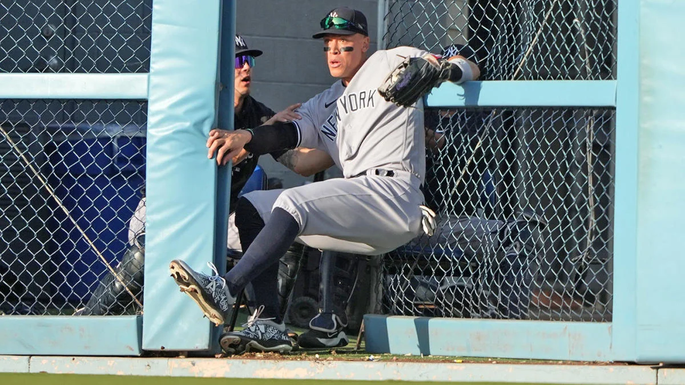
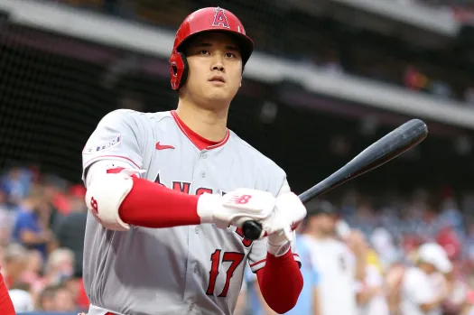
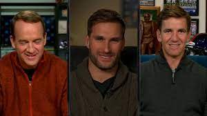

# Experience Prototypes

## Injury Prediction

My first experience prototype focused on the idea of improved injury prediction. A common need that showed up in my interviews was people feeling like it was hard to know when players would return from injuries and that the information they were given wasn't reliable. I wanted to test how that makes people feel, so I came up with a fictional injury and described 5 timelines of the recovery process that involved different specificity and accuracy of information for how the injury was healing. The first interview I did was with my friend Ethan, who is a deeply passionate fan. He was a great person to test, since he was able to draw on his past experiences as a fan to relate to each of the different scenarios I gave him. He preferred scenarios that were more specific and accurate as I expected. An interesting insight was that he greatly preffered a scenario in which I overestimated the injury return date by a month as opposed to one where I underestimated by a month, so even though the predictions were equally far off the player returning sooner than expected made it seem better. My second interview was with Jesse, another friend of mine. Jesse gave me a lot of similar insights to Ethan honestly. He also used his past fan experiences, such as a palyer he liked named Aaron Judge who had a bad toe injury that took much longer to heal than expected. Overall, my assumption that fans are unhappy with the accuracy of injury information right now and would be happier with better information seems to be generally accurate.

## Accessible Information

This prototype was based on my assumption that there is better information about injuries to be found and it is just hard for fans to access. I had a fan give me the name of a currently injured player who they wanted to know more about and then I researched their injury and reported it back to the fan to act as an all-in-one resource for the injury information they wanted. My friend Gideon gave me Jaire Alexander, a Green Bay Packers player who has a shoulder injury. This immediately challenged my assumptions, as I had a very difficult time finding information about him. It seemed like its likely an aggrivation of a previous injury, but the team and player both have not actually said anything about what the injury is so I had nothing to go off of. Gideon was disappointed to not know more, but appreciated having the additional information anyway. I also worked with Ethan again, who wanted to know about Shohei Ohtani, a new star for the LA Dodgers. Ohtani has a torn UCL, a very bad elbow injury that will prevent him from pitching for the next year. However, he will be able to hit as usual. Something I helped Ethan find out about was the long-term effects of the injury. There is a common assumption amongst baseball fans that UCL injuries, especially a second one like Ohtani has now, leads to worse performance and higher risk of reinjury. Through my research, I found that this was not the case as some players did see those effects, but equally many came back perfectly healthy and better than ever. This seemed to provide him a lot of reassurance and confidence, showing that there is something to the idea that fans would benefit from easier access to injury information.

## Injured Commentators

My last prototype addressed a very different aspect of fan experience. I assumed that part of the issue with injuries is that fans want to see their favorite players more often and would enjoy having these injured athletes commentate games in order to provide a unique athlete-centric experience to games on TV. This was a challenging prototype to create, since it is hard to simulate the idea. I ultimately decided to have two people watch Monday Night Football on the two differentt broadcasts ESPN runs. In the first half, they watched the standard broadcast, which is similar to any normal viewing experience a fan could have across any sport. In the second half, they watched ESPN's ManningCast, which features the Manning brothers running a unique broadcast that is less formal and structured than a traditional broadcast and is centered around them and other professional athletes they bring on as guests talking about the game. While it couldn't exactly recreate my vision for having injured players act as commentators while they are out, it does provide a somewhat similar alternative broadcast that allowed me to test how fans react to that different structure. My first user was Johnnny, a football fan who watches regular football broadcasts every week. He did not like the ManningCast very much, as he felt it distracted from the game, which is what he wanted to focus on. He very much preferred the traditional version which he is accustomed to. My other user, Dode, felt the opposite way. He thought the ManningCast was much more entertaining than the normal broadcast and really enjoyed the perspective they could bring to the game. Ultimately, my assumptions here ended up being more questionable but I still learned a lot from the two differing opinions.

## Slideshow

https://docs.google.com/presentation/d/1bSJlzYO_VVEpdBrXYa12A6NgThua5vvw6Ve9U0OMT9U/edit?usp=sharing