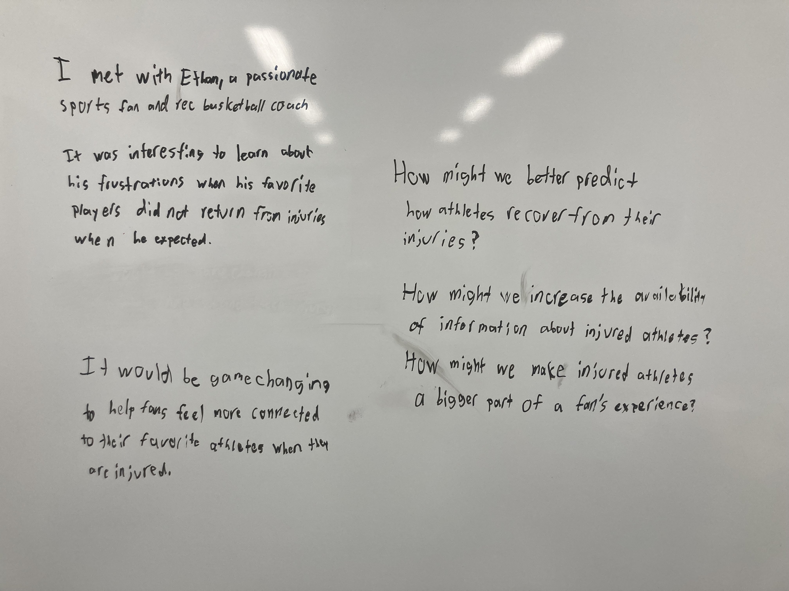

# POV and HMW Journal

This POV and set of 3 HMWs was based off of my interview with Ethan. While he was somewhat difficult to interview at times, he talked a lot about his frustrations with players that did not return from injuries when he expected. Based on the interview, it seemed like he felt very connected to these players, but struggled to enjoy that connection when players are hurt. Therefore, I wanted to also focus on ideas that help fans feel more connected to injured players.

The three HMWs I settled on were all based on aspects of the interview. The first, which was about improved prediction of injury recovery, relates to his frustrations not knowing when his favorite players will be healthy again. He told a story about a player he liked whose return was delayed for several consecutive weeks, so this HMW was based on addressing that issue. Similarly, my HMW about information about injured athletes was based on the idea that there is not enough reliable information about these injuries. For that same story about the injured player, I figured that improved information coming from the team and the player could similarly help him feel comfortable as a fan to having a better return prediction. My final HMW took a different approach, as it seeks to address that connection between fans and injured athletes. While this issue is a bit more complex to address, seeking to find ways for fans to connect with injured players could really be gamechanging.