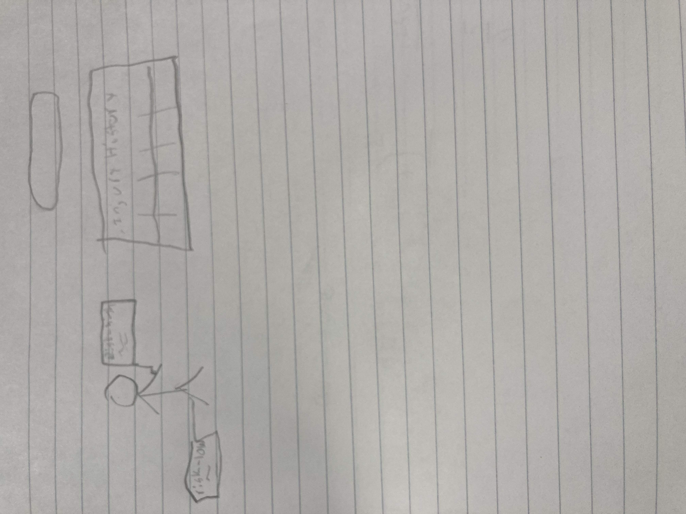
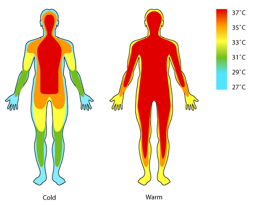

# Project Plan: MVP and Proof of Concept

## Project Idea
I want to make a website or possibly app that can provide information about athletes' injuries. I will have it track information about injuries for a sport and provide information about injury risk and recovery as well.

## MVP
The MVP, or minimal viable project, for this idea involves a few components. I want a heatmap for injury risk that allows users to click on different parts of the body to learn about the injuries the athlete has suffered in that area. There will also be a table that provides more specific information about the injuries and a search bar to allow users to find the athlete they want to know about.

## Proof of Concept
The biggest unknown in this project is how to make the interactive heat map of the body. I have to do more research into the best way to make an example of this stil but I will just make a heat map for one player and that will be transferable to making all the other ones.

## Nice to Haves
The main nice to have feature would be to generate data about risk and recovery using machine learning. I would also want to use that machine learning tool to provide the user with the most similar players to the one they are looking at. Ideally, I would also be able to include multiple sports instead of focusing on one.